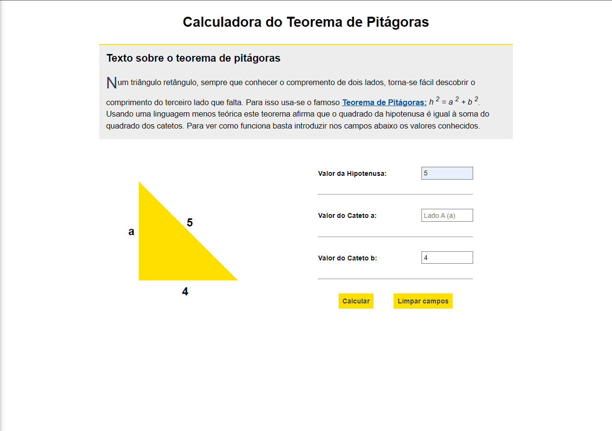

#

A simple Pythagoras Theorem Calculator, built with [React](https://reactjs.org/) and [Flask](https://flask.palletsprojects.com/en/2.1.x/).

## Features

- Calculate the value of one side of a right triangle;
- Visualize the values in the triangle;
- An API endpoint that makes the calculation;
- Responsive design;

## Snapshots



## Built With

- React
- Flask
- Vite
- Python
- Typescript

## Development Environment (Local)

### System Requirements

💡 Before you begin, make sure you have all the below installed:

- Node.js v16.x or above
- Yarn 1.22.x or above
- Python 3.10 or above
- Pip3

1. Initializing the frontend app

- Clone this repo
- Go to `.../frontend/`
- Run `yarn` and `yarn dev`
- The application opens in `http://localhost:3000/` or any other available port

2. Initializing the backend app

- First go to `.../backend/`

- Open a new terminal window and run the following commands:

```python
# Linux
sudo apt install pipenv
pipenv install
pipenv shell

# macOS
brew install pipenv
pipenv install
pipenv shell

# Windows
pip install pipenv
pipenv install
pipenv shell

#Then start the flask development server

# Linux
export set FLASK_APP=app.py
python -m flask run or flask run

# macOS
export set FLASK_APP=app.py
python -m flask run or flask run

# Windows
set FLASK_APP=app.py
python -m flask run or flask run

```

More information on how to configure a flask app can be found [here](https://code.visualstudio.com/docs/python/tutorial-flask)

#

Contributions, issues and feature requests are always welcome!
Star the repo if you like this project :)
